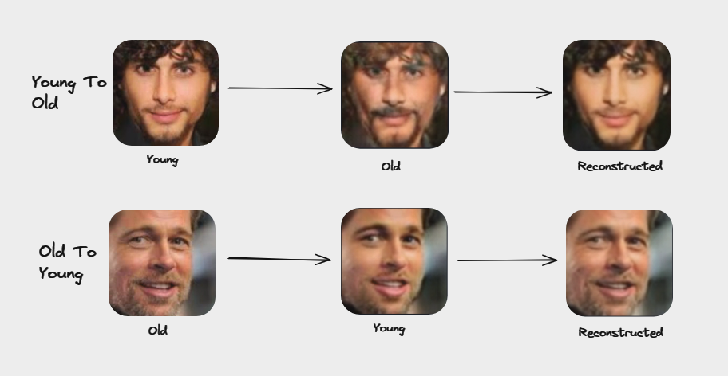

# Ageing-Deageing
This repository contains the implementation of CycleGAN to train a model to translate young faces to old and vice-versa.

# CycleGAN
CycleGAN, or Cycle-Consistent Generative Adversarial Network, is a type of GAN used for unpaired image-to-image translation. It consists of two sets of GANs: one for translating images from domain A to domain B (a2b), and another for translating images from domain B to domain A (b2a). The "cycle-consistent" part ensures that an image translated from A to B and then back to A should closely resemble the original image.

So, CycleGAN is used to train on unpaired translation which is what is required in case of young-to-old translation as we won't find paired dataset that is same person in young and old phase.

### Architecture of CycleGAN

This is the basic overview of the architecture of CycleGAN.

# Dataset
Used cropped [UTKFace dataset](https://www.kaggle.com/datasets/jangedoo/utkface-new).

First we extracted only images in range of [20,30] and classified them as young and [50,60] and classified them as old. Basically, we divided the dataset into two folders named trainA and trainB.

# Training
`train.ipynb` have my main training code.
Points to be kept in mind before training:
* Download [UTKFace Dataset](https://www.kaggle.com/datasets/jangedoo/utkface-new) and keep it in same directory.
* Preprocess all the images (use `dataset_separate_and_preprocess.ipynb`) to 100x100 as it will decrease training time otherwise the code was taking days to finish training.
* We will get the folder `dataset_preprocessed` with two sub-folders `trainA` and `trainB`.
* New folders named `images` and `saved_models` will be created during training.
* For every 200 batch sample images will be saved in `images/dataset_preprocessed` and model will be saved in `saved_models` after every 2 epoch. 

# Results
After 72 epochs.

# To Use Pretrained Model
> Deployed model link : [Hugging Face](https://huggingface.co/spaces/arikrrr77/Ageing-Deageing)

# References

* Official CycleGAN [paper](https://arxiv.org/abs/1703.10593).
* Inspiration [from Dillon Erb & Chris](https://github.com/Paperspace/FaceApp-with-Deep-Learning).