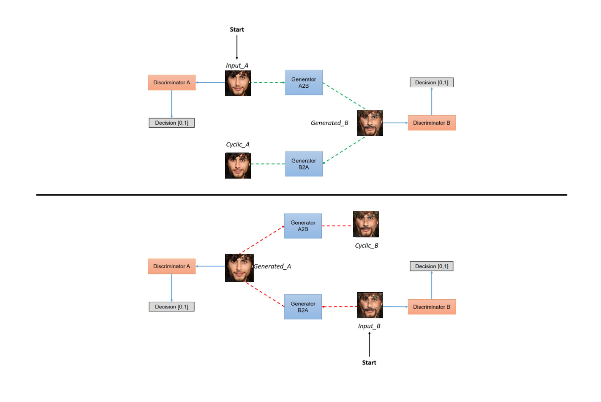

# Ageing-Deageing
This repository contains the implementation of CycleGAN to train a model to translate young faces to old and vice-versa.

# CycleGAN
CycleGAN, or Cycle-Consistent Generative Adversarial Network, is a type of GAN used for unpaired image-to-image translation. It consists of two sets of GANs: one for translating images from domain A to domain B (a2b), and another for translating images from domain B to domain A (b2a). The "cycle-consistent" part ensures that an image translated from A to B and then back to A should closely resemble the original image.

So, CycleGAN is used to train on unpaired translation which is what is required in case of young-to-old translation as we won't find paired dataset that is same person in young and old phase.

### Architecture of CycleGAN

